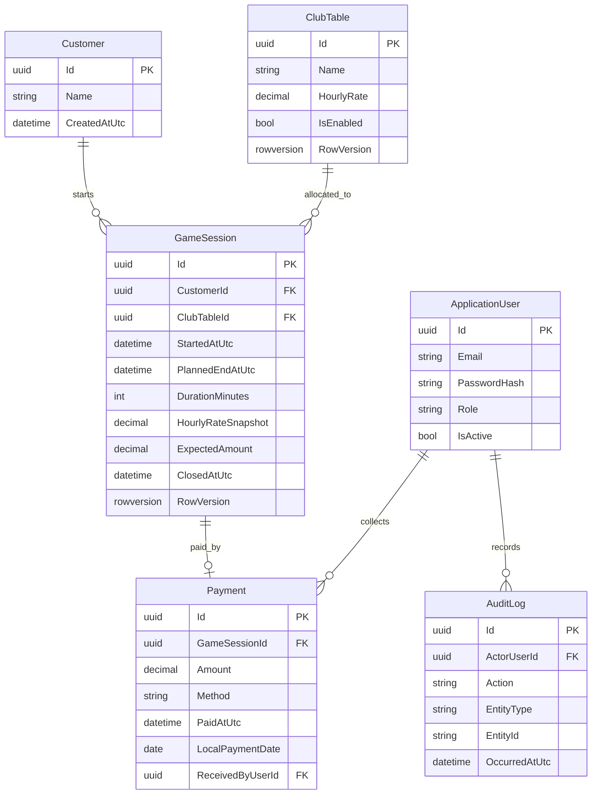

# Entity relationship diagram

```mermaid
erDiagram
  Customer ||--o{ GameSession : starts
  ClubTable ||--o{ GameSession : allocated_to
  GameSession ||--o| Payment : paid_by
  ApplicationUser ||--o{ Payment : collects
  ApplicationUser ||--o{ AuditLog : records
  Customer { uuid Id PK string Name datetime CreatedAtUtc }
  ClubTable { uuid Id PK string Name decimal HourlyRate bool IsEnabled rowversion RowVersion }
  GameSession { uuid Id PK uuid CustomerId FK uuid ClubTableId FK datetime StartedAtUtc datetime PlannedEndAtUtc int DurationMinutes decimal HourlyRateSnapshot decimal ExpectedAmount datetime ClosedAtUtc rowversion RowVersion }
  Payment { uuid Id PK uuid GameSessionId FK decimal Amount string Method datetime PaidAtUtc date LocalPaymentDate uuid ReceivedByUserId FK }
  ApplicationUser { uuid Id PK string Email string PasswordHash string Role bool IsActive }
  AuditLog { uuid Id PK uuid ActorUserId FK string Action string EntityType string EntityId datetime OccurredAtUtc }
```

`GameSession.ClubTableId` has a **unique filtered index WHERE ClosedAtUtc IS NULL**. `Payment.GameSessionId` is globally unique.
